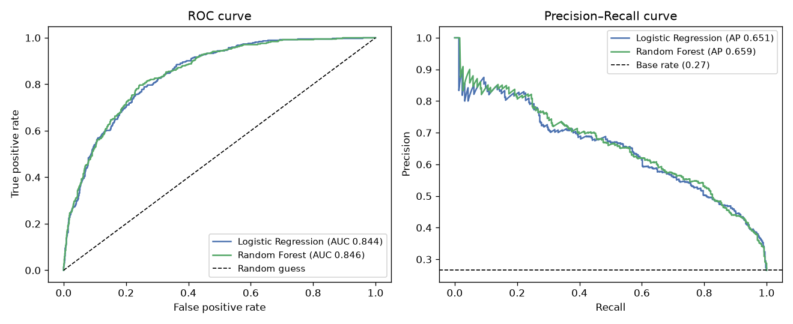
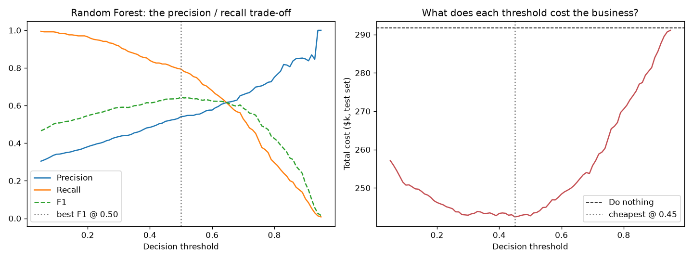
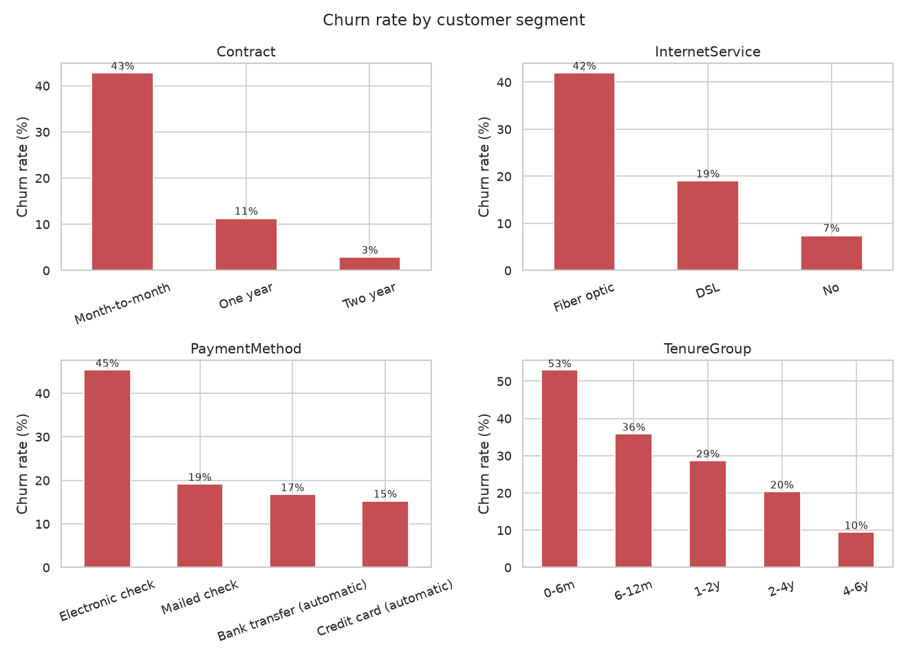
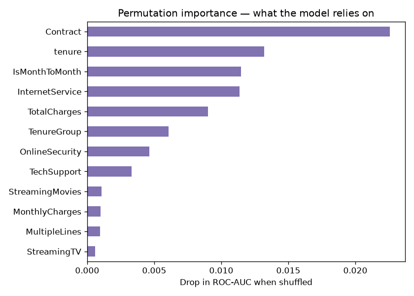

# 📉 Customer Churn Prediction (Telco)

Which customers are about to cancel? This uses IBM's **Telco Customer Churn** dataset: 7,043 customers of a phone/internet company, with their contract type, services, billing details, and whether they left in the last month.

What I liked about this one is that "how good is the model?" isn't the real question. The real question is **who should we actually call with a retention offer?** That's a business decision, and the model is only one input.

## Results (test set, 1,409 customers)

| Model | CV ROC-AUC | Test ROC-AUC | Test PR-AUC | Precision @0.5 | Recall @0.5 |
|---|---|---|---|---|---|
| Logistic Regression (C = 0.03, balanced) | 0.848 | 0.844 | 0.651 | 0.516 | 0.797 |
| **Random Forest** (depth 14, min leaf 20) | **0.848** | **0.846** | **0.659** | 0.541 | 0.794 |

Honestly these are a tie. The random forest edges ahead by 0.002 AUC, but logistic regression is far easier to explain to a non-technical person. If I were presenting this to a business team, I'd probably ship the logistic regression.

Why not accuracy? Only **26.5%** of customers churn, so a model that predicts "nobody leaves" is already 73% accurate and completely useless. ROC-AUC measures how well the model *ranks* customers by risk. PR-AUC focuses on the churners specifically (the dashed line on the right plot is the 27% you'd get by guessing).



## Picking the threshold like a business would

A model outputs a probability, and someone has to pick the cut-off. I set up some rough (made-up but plausible) economics:

- A retention offer costs **$50** per customer contacted
- Losing a customer costs about **$780** (≈ 12 months × $65 average bill)
- The offer saves about **1 in 3** customers who were actually going to leave

Then I computed the total cost on the test set for every threshold from 0.05 to 0.95:



The cheapest threshold is **0.45**. At that point the model catches **82% of churners** with **52% precision** (about one in two people we call was really going to leave). Compared with doing nothing, that saves roughly **$49k on just these 1,409 customers**. Because a lost customer costs much more than an offer, it pays to cast a wide net, which is why the best threshold sits at or below 0.5. The cost curve is also pretty flat between about 0.25 and 0.5, so the exact cut-off matters less than not being too cautious.

If the assumptions change (a cheaper offer, a more effective offer), the best threshold moves. That's the point: the threshold is a business knob, not a modelling detail.

## Who churns?

| Segment | Churn rate |
|---|---|
| Month-to-month contract | **42.7%** |
| Two-year contract | 2.8% |
| First 6 months as a customer | **52.9%** |
| 4–6 years as a customer | 9.5% |
| Pays by electronic check | 45.3% |
| Fiber optic internet | 41.9% |



New customers on month-to-month contracts are by far the riskiest group. The logistic regression odds ratios tell the same story: being in your first 6 months multiplies the churn odds by about 1.6×, and being month-to-month by about 1.5×. Fiber customers churning more is interesting. It probably points to a price or quality problem with that product, which is worth flagging to the business rather than just modelling around it.



## Data gotcha

`TotalCharges` looks numeric but is stored as text, and 11 customers have a blank `" "` in it. They all have `tenure = 0`: brand new, never billed. So the honest fill value is **0**, not the column mean. There's a unit test for this.

## Project structure

```
03-customer-churn-prediction/
├── src/
│   ├── data.py       # download, clean TotalCharges, engineered features
│   ├── eda.py        # churn rate by segment, distributions
│   ├── train.py      # LogReg vs RF, ROC/PR, threshold + cost analysis, importances
│   └── predict.py    # score a CSV and produce a ranked call list
├── tests/
├── outputs/          # metrics.json + figures/
└── models/           # model + chosen threshold
```

## Run it

The dataset downloads automatically the first time you run anything (it's small), and the trained model is already included, so `predict` works straight away.

```bash
git clone https://github.com/Aditya11-11/customer-churn-prediction.git
cd customer-churn-prediction
python -m venv .venv && source .venv/bin/activate   # Windows: .venv\Scripts\activate
pip install -r requirements.txt

python -m src.eda
python -m src.train
python -m src.predict data/Telco-Customer-Churn.csv --top 10 --out call_list.csv
pytest -q
```

## If I took this further

- Calibrate the probabilities (e.g. `CalibratedClassifierCV`) so a "0.7" really means 70%. That matters once the probabilities feed into cost calculations.
- Model *uplift* instead of churn: who is persuadable by an offer, not just who is likely to leave.
- Try gradient boosting, though I'd be surprised if it moved AUC by more than ~0.01 on this data.

---

## Part of a series

This is one of five ML projects I built while learning machine learning, each in its own repo:

- [🌸 Iris Flower Classification](https://github.com/Aditya11-11/iris-flower-classification)
- [🏠 House Price Prediction](https://github.com/Aditya11-11/house-price-prediction)
- [📉 Customer Churn Prediction](https://github.com/Aditya11-11/customer-churn-prediction) ← you are here
- [📩 Spam Classifier](https://github.com/Aditya11-11/spam-email-classifier)
- [✍️ Handwritten Digit Recognition (MNIST)](https://github.com/Aditya11-11/mnist-digit-recognition)

MIT licensed. See [LICENSE](LICENSE).
